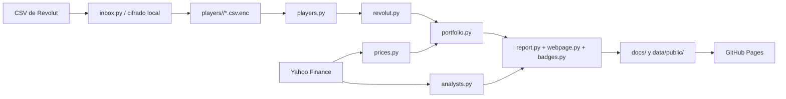
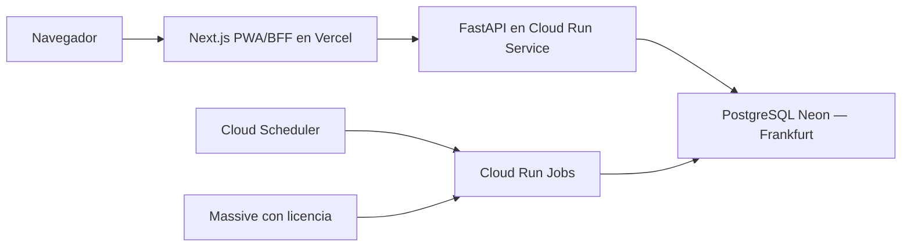

# Arquitectura de Trader

## Propósito y límites

Trader es una liga de rentabilidad de carteras Revolut. Es una aplicación
Python sin API ni base de datos: el repositorio es el almacenamiento
versionado y GitHub Actions ejecuta los procesos periódicos. El producto que
consulta el público es una web estática en `docs/`, publicada por GitHub
Pages, además de un ranking Markdown.

El diseño separa intencionadamente tres clases de datos:

| Clase | Ubicación | Visibilidad | Contenido |
|---|---|---|---|
| Fuente privada | correo IMAP o máquina local | privada | CSV exportado por Revolut |
| Fuente cifrada | `players/<id>/*.csv.enc` | pública pero ilegible | extractos AES/Fernet cifrados |
| Derivados públicos | `data/public/`, `docs/`, `data/badges.json` | pública | porcentajes, ranking, pesos de cartera y metadatos de mercado |

No hay conversión de divisas: cada cartera se calcula en la moneda de su
extracto. Por tanto, comparar porcentajes es el objetivo del sistema; no lo
es sumar importes de jugadores con monedas distintas.

El producto nuevo convive temporalmente en `tradearena/` como monolito modular.
No importa `trader/` ni consume sus CSV o artefactos. Hasta la retirada prevista
en la Fase 7, `trader/` sigue siendo el ranking histórico y `tradearena/` es la
fuente de reglas de la aplicación privada.

## Mapa de componentes



### Núcleo de dominio (`trader/`)

- `__main__.py` es la frontera de línea de comandos. Expone `encrypt`,
  `decrypt`, `report`, `ranking` e `inbox`; coordina módulos, no concentra la
  lógica de negocio.
- `revolut.py` convierte CSV tolerantes a variaciones de formato en `Event`.
  Reconoce compras, ventas, ingresos/retiradas, dividendos, comisiones y
  *splits*. Las filas desconocidas se ignoran con un aviso, en vez de romper
  el cálculo.
- `players.py` descubre carpetas de jugador, carga `player.json`, descifra
  todos los `*.csv.enc` y permite CSV en claro solo para pruebas locales. La
  clave específica `PLAYER_<ID>_KEY` tiene prioridad sobre `TRADER_KEY`.
- `secretbox.py` cifra el contenido con Fernet. El formato propio es
  `TRADERENC1 + salt de 16 bytes + token Fernet`; deriva la clave con PBKDF2
  SHA-256 y 600.000 iteraciones. No modificarlo sin mantener compatibilidad
  con los extractos ya versionados.
- `prices.py` mantiene `data/prices/<TICKER>.csv` con cierres de Yahoo Finance.
  `ensure_range` descarga o actualiza la caché; `close_on` arrastra el último
  cierre para festivos y fines de semana, mientras que `has_close` distingue
  una sesión real de mercado.
- `portfolio.py` reproduce eventos en orden cronológico y genera `DayResult`.
  También produce el valor actual por ticker y el desglose diario de P&L por
  valor, que se transforma a porcentajes antes de publicarse.
- `report.py` escribe `docs/ranking.md` y `data/public/<id>.json`. Respeta
  `show_amounts`: solo publica valores monetarios cuando el jugador lo permite.
- `webpage.py` construye el *payload* y lo incrusta en una única página HTML,
  CSS y JavaScript autocontenida. `COMPETITION_START` fija el inicio efectivo
  de la competición (actualmente 2026-07-14) para el ranking web.
- `analysts.py` obtiene en el build el consenso de Yahoo, lo normaliza y lo
  guarda en `data/analysts/`. Es opcional: un fallo de red conserva la caché o
  elimina esa sección, nunca fabrica datos.
- `badges.py` conserva en `data/badges.json` los hitos ya concedidos y el
  récord de mayor subida. Es un histórico incremental, no un resultado que se
  deba regenerar desde cero.
- `inbox.py` procesa la entrada por correo IMAP: autoriza la dirección contra
  `PLAYER_EMAILS`, exige DMARC aprobado o DKIM alineado, valida que el adjunto
  contiene eventos Revolut y escribe el cifrado en la carpeta asignada.
- `tickers.py` es el catálogo manual de nombre, dominio y valores relacionados
  que consume la web. Añadir un símbolo aquí mejora su ficha, pero no afecta al
  cálculo financiero.

### Monolito modular nuevo (`tradearena/`)

- `domain/` contiene dinero decimal, cartera, órdenes, ejecuciones, ledger,
  eventos corporativos y snapshots reproducibles. No conoce HTTP, PostgreSQL,
  Auth0 ni proveedores de precios.
- `application/` concentra cuentas, sesiones, ligas, roles, invitaciones,
  límites de plan y autorización. Una liga ajena se responde como inexistente.
- `ports/` define contratos de identidad y repositorios tipados dentro de una
  unidad de trabajo. Los servicios no conocen diccionarios ni SQL.
- `adapters/` incluye identidad local firmada, almacenamiento transaccional en
  memoria y `PostgresStore` síncrono con psycopg 3. Ambos adaptadores exponen el
  mismo contrato. PostgreSQL se inicializa con `migrations/001_initial.sql`.
- `presentation/` publica el dispatcher REST `/api/v1`, su contrato
  `openapi.yaml` y el primer adaptador ASGI FastAPI de TA-030. El adaptador
  conserva el dispatcher como frontera de aplicación, valida cuerpos tipados,
  expone `/health/live` y `/health/ready`, y verifica rutas y `operationId`
  contra el contrato. `presentation/server.py` compone la API con PostgreSQL y
  exige `DATABASE_URL`; no cae silenciosamente a memoria en producción.

La migración inicial cubre usuarios, identidad, sesiones, auditoría, ligas,
miembros, invitaciones, competiciones, carteras, órdenes, ejecuciones, ledger,
mercado, snapshots, facturación y notificaciones. Los límites Free se vuelven a
validar dentro de la transacción de aplicación; los índices SQL son una segunda
defensa, no el único control.

`python3 -m tradearena migrate` aplica por orden las migraciones SQL pendientes
y registra cada versión. La API se inicia con `python3 -m tradearena serve`;
ambos comandos usan `DATABASE_URL` pero
tienen ciclos de vida separados. El `Dockerfile` ejecuta la API como usuario
sin privilegios y permite usar la misma imagen para migrar sobrescribiendo el
comando.

`migrations/002_auth0_identity.sql` amplía de forma compatible la restricción
de proveedores para enlazar el `sub` estable de Auth0 sin alterar cuentas ni
identidades creadas por TA-030.

`migrations/003_league_reads.sql` añade índices parciales para listar miembros
activos e invitaciones pendientes por email sin modificar ni eliminar el
historial existente.

`migrations/004_competitions.sql` permite que un borrador no tenga todavía
`rules_snapshot`, registra `started_at`, indexa las competiciones por liga y
añade tanto una restricción de ciclo de vida como un trigger que impide cambiar
el snapshot una vez materializado.

`migrations/005_trading_ranking.sql` activa el modelo financiero reservado en
la migración inicial: distingue participantes tardíos, persiste posiciones,
conserva el motivo de rechazo de cada orden y admite identificadores
idempotentes opacos. `MemoryStore` y `PostgresStore` reconstruyen el mismo
agregado Python de cartera —órdenes, ejecuciones y ledger incluidos— y pasan el
mismo contrato de aplicación.

`migrations/006_fractional_reported_trades.sql` amplía cantidades de órdenes,
ejecuciones y posiciones a `numeric(28,8)` y añade a cada ejecución su origen,
importe total declarado, moneda, FX y referencia de compensación. Los datos de
TA-035 existentes se migran como `source=fixture`; el ledger PostgreSQL pasa a
ser estrictamente aditivo y verifica que un asiento ya persistido no cambie.

`migrations/007_user_commissions.sql` añade a cada orden una comisión opcional
no negativa. Conserva los datos existentes: las órdenes anteriores quedan sin
valor explícito y, si aún están pendientes, usan al ejecutarse el respaldo del
`rules_snapshot` que ya tenían asignado.

`migrations/008_initial_participant_calendar_join.sql` alinea la incorporación
de los participantes iniciales con el comienzo del calendario de competición,
también cuando el administrador la inicia más tarde. Solo corrige filas con
`joined_late=false`; una incorporación tardía conserva su instante real.

`migrations/009_notifications_privacy.sql` indexa el centro privado de
notificaciones por usuario/fecha y la auditoría exportable por actor. No altera
ni destruye filas anteriores y puede aplicarse tanto sobre la 008 como al crear
un esquema vacío.

`migrations/010_competition_dashboard.sql` completa el estado de proyección de
`portfolio_snapshots` y `ranking_snapshots` con jornada, provisionalidad y
versión de cálculo, además de índices para cierres canónicos idempotentes.
`competition_badges` conserva cada logro por competición y participante con
restricción única; recalcular no borra un logro concedido.

Al crear una liga Free se bloquea la fila del propietario antes de comprobar
su límite, y el índice parcial mantiene una segunda defensa. Al invitar o
aceptar se bloquea la liga antes de contar miembros e invitaciones pendientes,
de modo que dos solicitudes concurrentes no pueden consumir la misma plaza.

En TA-032 la invitación se entrega como un enlace opaco de alta entropía que
el propietario o administrador copia y comparte por el canal que elija; la
aplicación todavía no envía correo. El enlace caduca, puede revocarse y solo lo
puede aceptar una sesión cuyo email verificado coincida. Un enlace inexistente,
caducado, revocado o abierto con otra cuenta no revela la liga y responde
`404`; la PWA no muestra el código HTTP y presenta un único mensaje útil sin
distinguir cuál de esas condiciones se produjo.

### PWA y BFF (`web/`)

TA-031 incorpora una aplicación Next.js 16 con App Router, TypeScript estricto,
`pnpm` y rutas bilingües `/es` y `/en`. La pantalla de acceso, el alta de
perfil, la selección de idioma y el estado autenticado son responsive. El
manifest, el icono y un service worker limitado al shell/fallback offline
permiten instalarla como PWA; las rutas privadas, `/auth/*`, `/language` y los
orígenes externos no se guardan ni se interceptan. El worker devuelve siempre
una respuesta de red, caché, fallback o error válida.

Next.js es la única frontera del navegador. `/auth/login` crea `state`, `nonce`
y PKCE S256 dentro de una transacción cifrada y `HttpOnly` de diez minutos. El
callback intercambia el código con Auth0 desde servidor, sin entregar el ID
token al navegador. Después llama a `POST /api/v1/auth/session` con el ID token,
el nonce y un secreto exclusivo BFF↔API. FastAPI valida firma RS256 contra el
JWKS, emisor del tenant europeo, audiencia, caducidad, nonce y email verificado;
enlaza la identidad local y devuelve una sesión opaca revocable solo al BFF.

El BFF cifra esa sesión con A256GCM en una cookie `HttpOnly`, `SameSite=Lax` y,
cuando `APP_BASE_URL` usa HTTPS, `Secure` con prefijo `__Host-`. En local HTTP
usa un nombre sin prefijo y conserva el resto de protecciones. Los Server Components y Server
Actions descifran la cookie y añaden el bearer en la red interna. No existe
`NEXT_PUBLIC_*` para Auth0, API o sesiones; el bundle cliente no contiene
client secret, secreto BFF, ID/access token ni sesión opaca. Logout revoca la
sesión en PostgreSQL antes de eliminar la cookie. La autorización de ligas
sigue ejecutándose en FastAPI y conserva `404` para cualquier liga ajena.

`web/src/lib/api-schema.d.ts` se genera desde
`tradearena/presentation/openapi.yaml`; CI regenera el fichero y falla si hay
deriva antes de ejecutar lint, tipos, unitarias y build de producción.

TA-032 añade al BFF y a la PWA el listado, creación y detalle de ligas, las dos
plazas Free, miembros e invitaciones recibidas. Las mutaciones son Server
Actions que solo transmiten referencias y datos de formulario al API; FastAPI
vuelve a autenticar, autorizar y aplicar los límites dentro de la transacción.
El único componente cliente nuevo copia el enlace de invitación y no recibe la
sesión opaca ni ninguna credencial interna.

TA-033 añade `/{locale}/pricing` como página pública responsive dentro de la
misma PWA y un enlace desde su navegación pública. Muestra Free con una liga
activa, dos plazas y 3.000 USD iniciales por competición; Friends y Club figuran
como «Próximamente», sin precios, Checkout ni concesión de derechos. La llamada
a la acción se resuelve en el servidor hacia el acceso o `/{locale}/app` según
la cookie de sesión `HttpOnly`. La facturación y la activación de esos planes
continúan reservadas para la Fase 5.

TA-034 añade casos de uso y repositorios de competición con el mismo contrato
en memoria y PostgreSQL. Propietario y administrador crean un borrador con
nombre y calendario; cualquier miembro activo puede leerlo. Al iniciarlo, el
backend vuelve a autorizar la liga, bloquea liga y competición y copia en
`rules_snapshot` una estructura v1 con calendario XNYS, zona
`America/New_York`, reglas operativas y el capital Free fijo de `3000.00 USD`.
La copia se realiza en ese instante, se devuelve como dato independiente y no
puede actualizarse después ni desde la aplicación ni directamente en SQL.

La API expone listado/creación bajo
`/api/v1/leagues/{league_id}/competitions`, detalle y la acción explícita
`.../{competition_id}/start`. Todas las rutas validan primero la membresía de
la liga indicada y tratan como `404` una liga ajena, una competición ajena o
una competición que no pertenece a la liga de la URL. La PWA amplía el detalle
de liga con el formulario de calendario, inicio y una confirmación ES/EN que
muestra claramente que reglas y calendario quedaron fijados. Las Server
Actions siguen transmitiendo solo referencias y formulario; la sesión opaca
permanece cifrada en la cookie `HttpOnly` del BFF.

TA-035 materializa como participantes a todos los miembros activos al iniciar
y crea para cada uno una cartera con el capital de `rules_snapshot`; en Free
son exactamente `3000.00 USD`. Su incorporación se fija en el inicio del
calendario, por lo que pueden declarar operaciones realizadas desde ese
instante aunque la competición se activase después. Aceptar una invitación después del inicio crea
la cartera en la misma transacción con el capital íntegro y `joined_late=true`.
La expulsión corta el acceso, pero conserva el historial financiero.

`TradingService` es la única frontera de decisiones de cartera. Lee calendario,
capital y las comisiones de respaldo del snapshot inmutable, entrega el agregado
al motor Python y persiste el resultado. Acepta cantidades decimales positivas
de acciones con hasta ocho decimales, compra/venta,
mercado/límite y sesión regular o ampliada; nunca ejecuta una cotización anterior
a la orden, no divide ejecuciones y rechaza sin comisión la falta de efectivo o
posición. Cada orden puede fijar una comisión no negativa; si se omite, el
motor aplica al ejecutarla la comisión regular o ampliada del snapshot. Las
órdenes permanecen GTC hasta ejecución, cancelación, fin del
calendario fijado o suspensión definitiva indicada por el puerto de mercado.

Durante TA-035 `FixtureMarketDataAdapter` proporciona precios deterministas en
pruebas. Para desarrollo local puede seleccionarse
`YahooFinanceMarketDataAdapter` con `MARKET_DATA_PROVIDER=yahoo`; la raíz de
composición es la única que conoce esa elección y los casos de uso continúan
dependiendo de `MarketDataPort`. El dashboard precarga una ventana por símbolo,
mantiene la respuesta incompleta ante un fallo y no arrastra cierres. Esta vía
no está autorizada para despliegue público: producción permanece con fixtures
hasta la integración licenciada y los jobs de Fase 4. Nunca se acepta un precio
enviado por el navegador. La valoración genera snapshots de cartera
y ranking porcentual con hash estable, desempate por usuario y marca visible de
incorporación tardía.

La ampliación de TA-035 añade `.../reported-trades` como caso de uso separado:
registra una ejecución simulada ya realizada, no una orden pendiente. Recibe
fecha, ticker, tipo, cantidad, precio por acción, total, moneda, FX y clave
idempotente. Python valida que la competición siga activa, el timestamp esté
dentro del calendario de `rules_snapshot`, no sea futuro ni anterior a la
incorporación. Desde TA-037 una declaración retroactiva se acepta solo si la
reproducción histórica conserva saldo y posición; los derivados se reconstruyen
desde esa jornada sin alterar las ejecuciones o el ledger previos. V1 exige USD/FX 1. La
comisión es opcional: si se omite, Python la infiere del bruto y el total; si
se proporciona, exige que coincida al céntimo con ambos.
La API interpreta fechas sin offset mediante la zona elegida (`Europe/Madrid`
por defecto o `UTC`) y normaliza coma o punto decimal en precio, importe y
comisión. El cálculo visual del formulario es solo una ayuda: el backend
recalcula y valida siempre el resultado antes de alterar la cartera.

Una declaración válida crea atómicamente orden `filled`, ejecución completa
`source=reported`, ledger balanceado y auditoría. Las ejecuciones del motor se
conservan como `source=fixture`. La clave se acota a la cartera y una repetición
idéntica no duplica historia. `.../reported-trades/{execution_id}/corrections`
revierte el efecto mediante otra ejecución y asiento compensatorios con
referencia al original; nunca actualiza ni borra la ejecución financiera.
Saldo y posición siguen impidiendo margen y corto también durante la
compensación.

La API añade `.../portfolio`, `.../orders`, cancelación por id y `.../ranking`.
Todos vuelven a comprobar liga, competición, cartera y orden; un recurso ajeno
responde `404`. El BFF conserva la sesión cifrada `HttpOnly`, y las Server
Actions solo envían referencias y campos de orden. La PWA responsive ES/EN
muestra cifras calculadas por Python; TypeScript solo sugiere la diferencia
aritmética en el campo de comisión y no decide saldo, validez del total,
posición, valoración ni rentabilidad.

TA-036 activa `NotificationService` y el repositorio `notifications` con el
mismo contrato en memoria y PostgreSQL. `GET /api/v1/notifications` lista solo
las notificaciones de la sesión, nuevas primero, y
`POST /api/v1/notifications/{id}/read` fija `read_at` una sola vez. Repetir la
acción devuelve el mismo resultado sin duplicar auditoría; un identificador
ajeno o inexistente responde `404`. Python elimina de los payloads cualquier
clave asociada a tokens, secretos, contraseñas, credenciales, autorización o
cookies antes de persistirla o exponerla.

La exportación de `GET /api/v1/me` queda versionada como esquema 1, ordenada y
sin una marca de generación variable: incluye cuenta y perfil propios,
membresías e invitaciones recibidas, notificaciones, auditoría relacionada y
cada cartera propia con competición, posiciones, órdenes, ejecuciones y ledger.
Excluye sujetos de identidades externas, hashes de sesión, tokens, secretos, credenciales,
rankings compartidos y datos financieros de otros participantes. La ruta BFF
`/account/export` entrega exactamente ese JSON como descarga sin caché; no
reconstruye reglas de privacidad en TypeScript.

`DELETE /api/v1/me` exige `confirm_account_deletion=true` en el backend. En una
única transacción marca la cuenta como eliminada, sustituye el email por un
alias irreversible ligado al UUID, elimina identidades y perfil, anonimiza ese
email en invitaciones, borra notificaciones, retira membresías activas y revoca
todas las sesiones. Se conservan UUID internos, auditoría, participaciones,
carteras, órdenes, ejecuciones y ledger para integridad financiera. Al no quedar
sesión ni membresía activa, la cuenta eliminada no puede acceder a ligas,
competiciones, carteras, órdenes, operaciones o notificaciones; las fronteras
privadas mantienen `404` para recursos ajenos.

TA-037 añade una proyección de aplicación separada del ranking puntual. Recorre
las jornadas XNYS desde el `rules_snapshot`, usa las 16:00 de Nueva York como
cierre canónico y admite un punto provisional para la sesión actual solo desde
la apertura regular de las 09:30; antes conserva como último punto el cierre de
la jornada anterior. Reproduce
solo ejecuciones efectivas, incluidas comisiones y compensaciones, desde
`joined_at`. Para una posición abierta exige una cotización de esa misma sesión:
no arrastra cierres ni usa el precio declarado como sustituto. Un hueco marca
la jornada y el contrato como `incomplete`.

`DashboardService` autoriza de nuevo sesión, membresía, liga y pertenencia de
competición antes de construir
`GET /api/v1/leagues/{league_id}/competitions/{competition_id}/dashboard`.
El contrato contiene exclusivamente retornos, posiciones de ranking, pesos,
estadísticas, badges e información saneada de ejecuciones. Los importes usados
internamente para valorar y normalizar se descartan: cantidades, precios,
totales, comisiones, efectivo, equity, ledger, órdenes y claves idempotentes de
otros participantes no alcanzan la respuesta. Las cuentas eliminadas reciben
un nombre anónimo y los expulsados conservan historia pero no rango vivo.

La PWA mueve el panel completo a
`/{locale}/app/leagues/{leagueId}/competitions/{competitionId}`. El detalle de
liga solo muestra tarjetas enlazables. La nueva pantalla renderiza series SVG
con color estable derivado del participante, meses, ganadores, operaciones,
insights deterministas, standings, portfolios porcentuales y jornadas; los
detalles desplegables sustituyen tablas anchas en móvil. El panel monetario de
la cartera propia sigue usando el endpoint privado anterior.

TA-037 no lee `players/`, `data/public/`, cifrados, CSV/PDF ni módulos de
`trader/`; tampoco llama a brokers, modelos generativos o servicios de IA. La
excepción temporal de desarrollo para Yahoo está aislada tras `MarketDataPort`
y no reutiliza cachés ni código del legado. El enriquecimiento licenciado de ticker, históricos y consenso neutral de
analistas queda en Fase 4 y se omite si no hay proveedor autorizado.

### Portabilidad operativa

`Dockerfile` es el artefacto OCI común de API/migración y `Dockerfile.web` el
artefacto de la PWA/BFF. `compose.yaml` proporciona la referencia
ejecutable para una máquina local o servidor Docker: PostgreSQL privado con
volumen persistente, migración finita, API y web sin privilegios. `.env.example`
enumera configuración sin secretos, `scripts/install-compose.sh` instala o
actualiza y `scripts/verify-deployment.sh` ejecuta los smoke tests.

`doc/instalacion-despliegue.md` es el runbook canónico. Todo entorno futuro
debe versionar infraestructura, secretos requeridos sin valores, despliegue,
migraciones, health checks, backup/restauración y rollback. Una configuración
que solo exista en la consola de un proveedor no forma parte de la arquitectura
soportada.

### Despliegue objetivo de TradeArena



- Vercel servirá la PWA, creará previews por rama y conservará la sesión en el BFF;
  el navegador no se conecta a PostgreSQL ni recibe el token interno de API.
- FastAPI se desplegará en un Cloud Run Service con escala a cero usando el
  servidor ASGI, el adaptador PostgreSQL y la imagen OCI de TA-030.
- Neon `aws-eu-central-1` es la fuente de verdad. Los PR que cambien backend o
  migraciones usarán una rama efímera solo para integración en CI; las previews
  de interfaz no acceden directamente a esa rama.
- Precios, órdenes, eventos corporativos, valoraciones y rankings se ejecutarán
  como Cloud Run Jobs finitos, separados e idempotentes. Cloud Scheduler los
  invocará con identidad de servicio; no se mantendrán workers permanentes en
  el MVP.
- Staging usa Cloud Run `europe-west3` y Neon en Frankfurt. Secret Manager
  conserva credenciales y GitHub Actions accede a GCP mediante OIDC.

### Datos y contratos principales

`players/<id>/player.json` define `display_name`, `currency` y
`show_amounts`. Solo el primero es obligatorio en la práctica: hay valores
por defecto. Los extractos pueden estar divididos en varios `*.csv.enc`; se
unen y ordenan por fecha al cargar.

El CSV de Revolut se espera con columnas como `Date`, `Ticker`, `Type`,
`Quantity`, `Total Amount` y `Currency`. El parser acepta `Total` como
alternativa y formatos de fecha y número habituales de EE. UU. y Europa.

`DayResult` contiene valor inicial/final, flujo externo, P&L, retorno diario y
retorno acumulado. `data/public/<id>.json` siempre contiene fecha y porcentajes
diario/acumulado; con `show_amounts: true` añade inicio, fin, flujo y P&L.

La web recibe además, embebidos en `docs/index.html`, los últimos 30 días,
pesos agregados por ticker, pesos de cada cartera, operaciones recientes sin
importe/cantidad, precio histórico público, consenso de analistas, desglose
porcentual diario e insignias. Los valores monetarios intermedios no se
publican cuando la configuración de privacidad no lo autoriza.

## Cálculo de rentabilidad

Para cada fecha desde la primera operación se aplican eventos y se valora
efectivo más posiciones. Solo se emite una fila cuando existe un cierre real
para al menos un ticker de la cartera; los flujos de días no bursátiles se
acumulan hasta la siguiente sesión.

La puntuación diaria usa Dietz simple:

```text
r_día = (V_final - V_inicial - flujo_externo) / (V_inicial + flujo_externo / 2)
```

Los ingresos (`TOPUP` y `TRANSFER FROM`) y retiradas no generan rendimiento;
compras y ventas sí cambian efectivo/posiciones, dividendos suman efectivo,
comisiones lo restan y los *splits* corrigen la cantidad. El acumulado es un
retorno ponderado por tiempo: `producto(1 + r_día) - 1`. Antes de publicar el
ranking, `rebase_from` reinicia esta composición en `COMPETITION_START`.

## Automatización y despliegue

| Workflow | Disparador | Responsabilidad |
|---|---|---|
| `.github/workflows/ci.yml` | cada pull request | instala dependencias, prueba PostgreSQL 16 y migraciones, construye y verifica la instalación Compose desde cero, ejecuta toda la suite Python y reproduce el ranking histórico offline con datos ficticios |
| `.github/workflows/inbox.yml` | `repository_dispatch` o manual | lee IMAP, autentica, cifra extractos, recalcula y publica si hubo cambios |
| `.github/workflows/ranking.yml` | cambios en `players/` o `trader/`, dispatch o manual | ejecuta tests, actualiza precios/analistas, genera artefactos y abre/cierra aviso de extractos no descifrables |
| `.github/workflows/guard.yml` | push a `main` | para la vía de token, revierte cambios fuera de la carpeta del jugador asignado en `PLAYER_OWNERS` |

Los workflows de ingesta y ranking usan grupos de concurrencia y reintentos de
`rebase` al publicar, porque ambos pueden regenerar `docs/` y `data/` a la vez.
La carpeta `docs/` es la raíz configurada para GitHub Pages; no confundirla con
`doc/`, que contiene documentación de mantenimiento.

El CI de pull request no usa secretos, red externa ni datos reales. Es una
puerta de línea base para todo el repositorio; TA-030 añade el contrato OpenAPI
y PostgreSQL 16 aislado sin sustituir las comprobaciones deterministas.

La automatización anterior pertenece al legado. TradeArena añadirá CI de
backend/PWA, ramas Neon efímeras para integración y despliegue de staging tras
fusionar. Vercel gestionará las previews de la PWA; Cloud Run no se desplegará
por PR. La promoción de producción será explícita y permanecerá bloqueada por
las puertas legales, de licencia y recuperación.

## Seguridad y operaciones

- `TRADER_KEY` es el secreto de liga compartido. En CI permite descifrar todos
  los extractos; una clave por jugador es una extensión soportada por las
  variables `PLAYER_<ID>_KEY`, aunque no es el flujo configurado por defecto.
- La ingesta por email es la vía con menor privilegio para jugadores: no les
  entrega token ni frase. `PLAYER_EMAILS` es el control de acceso y
  `INBOX_TRUSTED_AUTHSERV` puede restringir quién certifica DMARC/DKIM.
- La subida web/CLI con token depende de `PLAYER_OWNERS`. El guardián es una
  red de seguridad reactiva; no sustituye un control de escritura estricto.
- Nunca se deben añadir CSV sin cifrar. `.gitignore` bloquea
  `players/**/*.csv`, pero se debe revisar el diff antes de publicar.
- Las cachés de precio, analistas y badges son datos derivados versionados. No
  se editan a mano salvo una corrección deliberada y documentada.

## Verificación local

```bash
python3 -m venv .venv
source .venv/bin/activate
python3 -m pip install -r requirements.txt
python3 -m pytest tests/ -q
python3 -m trader ranking --players-dir examples/players --prices-dir examples/prices --offline
```

`.python-version` fija Python 3.12, `requirements.in` declara dependencias
directas y `requirements.txt` fija la resolución completa que usa CI. El
último comando usa datos ficticios y no requiere red ni secretos. Para
probar una modificación de privacidad o de la web, inspecciona también el
`docs/index.html` regenerado y los JSON de `data/public/` antes de incluirlos
en un cambio.
